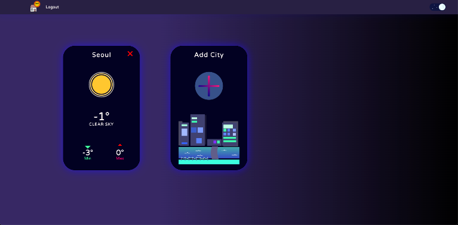

# 🌃 House The Weather?

## 🙇‍♂️ contributors

- [👨🏻 이승환](https://github.com/sh981013s)
- [👧🏻 문유선](https://github.com/moonnew)

## 📄 Description

최대한 간편하게 깔끔한 UI 를 통해 오늘의 날씨 확인 및 날씨 예측을 위한 SPA 입니다.

## 🖥 Demo



* `Live Demo on Netlify:` <a href="https://house-the-weather.netlify.app/" target="\_blank">https://house-the-weather.netlify.app/</a>

## 🎠 기능

#### 👩‍🌾 User

- [x] **회원 가입**
- [x] **로그인**
- [x] **로그아웃**
- [x] **도시 검색**
- [x] **검색한 도시로 추가**
- [x] **현재위치 기반 도시로 추가**
- [x] **도시 삭제**
- [x] **도시 디테일 확인**

#### 💻 System

- [x] **Suspense & lazy 사용하여 로딩 화면 구현**
- [x] **실시간 데이터베이스로 인한 즉시 확인**

## 📀 Setup Locally

have to create dotenv file at root dir

```dotenv
// firebase

REACT_APP_API_KEY = ""
REACT_APP_AUTH_DOMAIN = ""
REACT_APP_PROJECT_ID = ""
REACT_APP_STORAGE_BUCKET = ""
REACT_APP_MESSAGING_SENDER_ID = ""
REACT_APP_APP_ID = ""

// openWeather
REACT_APP_OPENWEATHER_KEY = ""

// googleMap
REACT_APP_GEO_APIKEY = ""
```

```bash
git clone https://github.com/sh981013s/react-weather.git
cd react-weather
npm install
npm run start
```

## 📚 Used packages

- "axios": "^0.24.0"
- "firebase": "^9.6.3"
- "framer-motion": "^5.6.0"
- "react": "^17.0.2"
- "react-dark-mode-toggle": "^0.2.0"
- "react-dom": "^17.0.2"
- "react-places-autocomplete": "^7.3.0"
- "react-router-dom": "^5.3.0"
- "react-scripts": "5.0.0"
- "react-spinners": "^0.11.0"
- "styled-components": "^5.3.3"
- "styled-reset": "^4.3.4"
- "web-vitals": "^2.1.3


